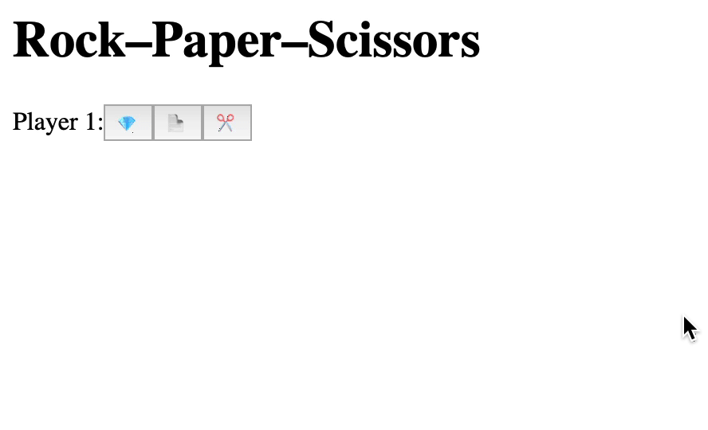
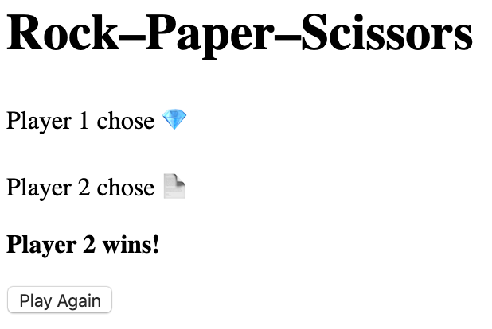

# Assignment 6: Implementation · React

# Working on Assignment

<video src="https://archive.org/download/jhu-oose/oose--assignments--6.mp4" controls preload="none"></video>

<small>
**50 points**
</small>

Starting from the code we wrote together in [lecture](/lectures/6).

First, finish the implementation by addressing the [TODOs left over from lecture](https://github.com/jhu-oose/todoose/blob/b33f16f6a004e8e6cbc5c75877583022e0b81d00/index.js#L1-L3). This is how the game should work:

<figure markdown="1">
{:width="444"}
</figure>

Then add the following features.

# A “Play Again” Button

<small>
**20 points**
</small>

<figure markdown="1">
{:width="309"}
<figcaption>
A screenshot of the game with the “Play Again” button.
</figcaption>
</figure>

The button must work by resetting the state of the React components, not by reload the page.

# Lizard 🦎 and Spock 🖖

<small>
**20 points**
</small>

Extend the game following the rules from [this The Big Bang Theory episode](https://bigbangtheory.fandom.com/wiki/Rock,_Paper,_Scissors,_Lizard,_Spock).

# Add an Explanation of Why Someone Won

<small>
**10 points**
</small>

With Lizard and Spock the game got too complicated, so a simple “Player 2 wins!” isn’t enough anymore. When the game is over, add an explanation, for example, “Lizard poisons Spock, so Player 2 wins!”


